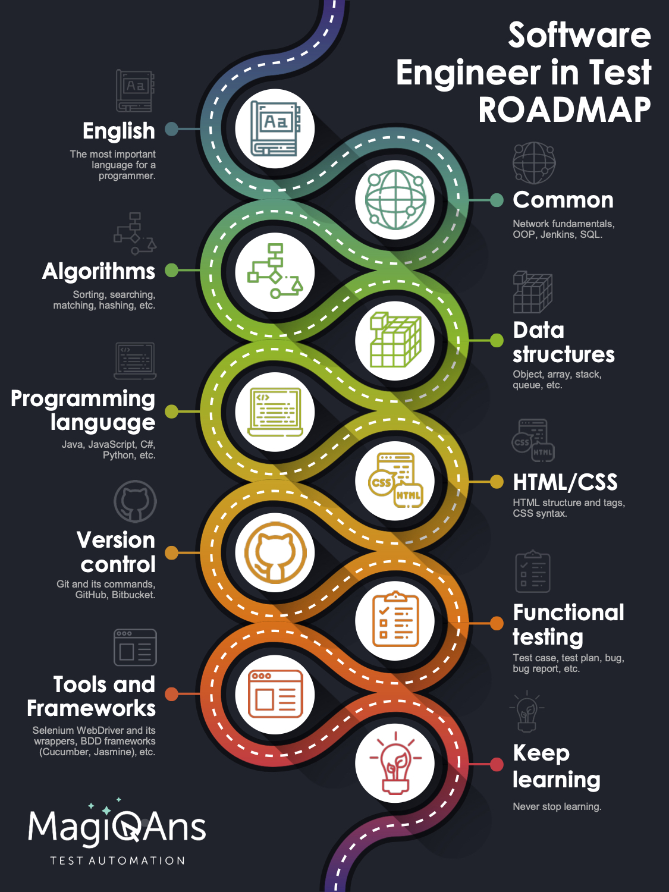

# Карта знаний

# Этапы

## English
Самый важный компонент во всей карте. Здесь необходимо уметь читать техническую документацию а также объяснить собеседнику о чем была статья
## Common
Сюда входят основные вещи, такие как работа сетей и их протоколов, знание ООП, что такое Jenkins, и др.
## Algorithms
Базовые алгоритмы. Сюда входят такие вещи как алгоритмы сортировки(пузырьком, вставки, быстрый),поиска(бинарный, линейный), сложность алгоритма и др.
## Data structures
"Кирпичики" любого языка. Это как примитивы(строки, булеаны и др.), так и более сложные(объекты, массивы, списки)
## Programming language
Основные языки программирования использующие автоматизацию - это C#, Java, JavaScript, Python
## HTML/CSS
Большая часть автоматизации сводится к поиску HTML элементов на странице, поэтому основы HTML & CSS необходимо знать.Также сюда входят стратегии поиска элементов(ByClassName, ByCssSelector,By TagName, XPath)
## Version control
Система котроля версии пожалуй одна из базовых вещей в программировании, поскольку она позволяет версионировать ваш код. Флагманом в система контроля версии является Git. Подробнее про гит можно прочитать [тут](https://git-scm.com/book/ru/v2)
## Functional Testing
## Tools and Frameworks
## Keep Learning
Продолжайте читать и изучать различные источники информации. Агрегируйте и применяйте накопленные знания на практике